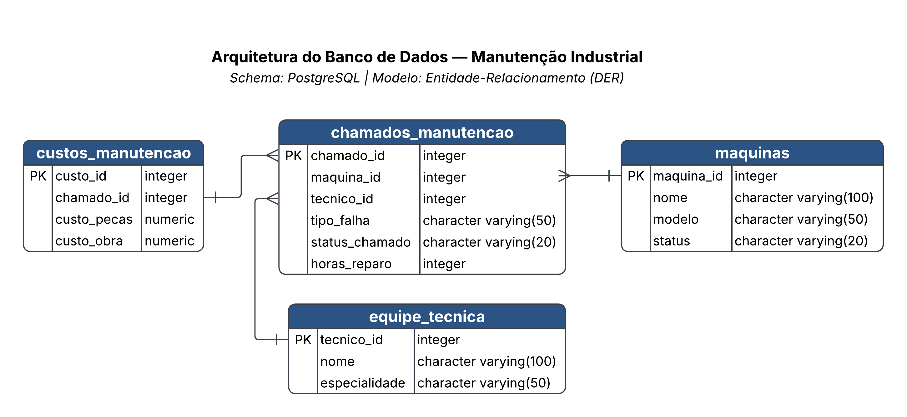

# Sistema de Gestão de Manutenção Industrial para análise OEE — PostgreSQL

Este repositório apresenta a arquitetura, modelagem relacional e implementação de um banco de dados relacional voltado ao acompanhamento operacional e financeiro de manutenções industriais. 
O projeto foi projetado sob os pilares de **Governança de Dados**, integridade referencial e rastreabilidade, fornecendo a base estrutural necessária para o cálculo e otimização do **OEE (Overall Equipment Effectiveness)** na gestão de ativos industriais.

---

## Visão Geral & Contexto Operacional

Na gestão industrial moderna, a manutenção não é apenas um centro de custos, mas um fator decisivo na disponibilidade e confiabilidade da planta. Para sustentar a tomada de decisão estratégica e suportar os pilares de **Qualidade** e **Eficiência**, este sistema estrutura o fluxo de dados desde o surgimento da falha até a consolidação dos custos operacionais.

### Conexão com o Indicador OEE (Overall Equipment Effectiveness)
A estrutura relacional foi modelada para alimentar de forma direta e consistente as métricas do OEE:
* **Disponibilidade (Availability):** O registro preciso das falhas (`tipo_falha`) e o cálculo de `horas_reparo` na tabela `chamados_manutencao` permitem mensurar com exatidão o tempo de parada não planejada (*Downtime*) e calcular o MTTR (*Mean Time to Repair*) e MTBF (*Mean Time Between Failures*).
* **Desempenho (Performance):** A vinculação direta com a tabela `maquinas` permite mapear quais ativos ou modelos apresentam gargalos recorrentes de produtividade.
* **Qualidade (Quality):** O controle de apontamentos e a categorização dos reparos garantem a rastreabilidade das intervenções que afetam a estabilidade do processo produtivo.

---

## Arquitetura & Diagrama de Entidade-Relacionamento (ERD)

A modelagem adota o padrão de tabela fato centralizada (`chamados_manutencao`) com relacionamentos estruturados com suas tabelas de dimensão e detalhamento:



---

## Governança, Qualidade e Padronização dos Dados

Para garantir a confiabilidade dos relatórios e dashboards analíticos (ex: Power BI / Metabase), foram aplicadas diretrizes rígidas de **Governança de Dados**:

1. **Integridade Referencial & Chaves:**
   * Garantia de relacionamentos consistentes por meio de Chaves Primárias (`PK`) e Chaves Estrangeiras (`FK`), impedindo a existência de registros órfãos (ex: um chamado registrado sem uma máquina ou técnico associado).
2. **Tipagem Estrita de Dados:**
   * Atribuição consciente de tipos de dados (`integer`, `character varying`, `numeric`) para assegurar performance de consulta, otimização de armazenamento e precisão nos cálculos financeiros de peças e mão de obra.
3. **Padronização de Status e Categorização:**
   * Normalização dos campos de estado (`status_chamado`, `status` da máquina e `especialidade`) para prevenir inconsistências de entrada e simplificar a criação de filtros em consultas SQL operacionais.
4. **Rastreabilidade e Auditabilidade:**
   * Centralização dos custos (`custos_manutencao`) associados estritamente ao `chamado_id`, permitindo auditorias financeiras e análise de *Custo Total de Manutenção por Ativo*.

---

## Dicionário do Modelo de Dados

| Tabela | Função / Papel | Chave Primária (PK) | Chaves Estrangeiras (FK) |
| :--- | :--- | :--- | :--- |
| **`maquinas`** | Cadastro e status dos ativos da planta industrial | `maquina_id` | N/A |
| **`equipe_tecnica`** | Cadastro de técnicos, nomes e especialidades | `tecnico_id` | N/A |
| **`chamados_manutencao`** | Tabela Fato: registro de ocorrências, horários e falhas | `chamado_id` | `maquina_id`, `tecnico_id` |
| **`custos_manutencao`** | Detalhamento financeiro (peças e mão de obra) por chamado | `custo_id` | `chamado_id` |

---

## Tecnologias e Ferramentas

* **SGBD:** PostgreSQL (pgAdmin 4)
* **Modelagem e Diagramação ERD:** Lucidchart
* **Linguagem de Consulta:** SQL (DDL / DML)
* **Engenharia/Análise de Dados:** Estruturação orientada a Kpis operacionais e OEE

---

## Próximos Passos: Construção do Dashboard no Power BI

Este repositório passará por atualizações contínuas para conectar a camada de banco de dados relacional à camada de inteligência de negócios (*Business Intelligence*). 

A próxima fase do projeto consistirá na integração direta do **PostgreSQL ao Power BI**, visando a construção de um dashboard executivo e interativo focado na gestão do **OEE** e desempenho da manutenção.

### Painel de KPIs & Indicadores no Power BI:
* **Índice de Disponibilidade (OEE):** Monitoramento contínuo das horas de parada não planejadas (*Downtime*) por ativo.
* **Métricas de Confiabilidade (MTTR & MTBF):** Cálculo do Tempo Médio para Reparo (*Mean Time to Repair*) e Tempo Médio Entre Falhas (*Mean Time Between Failures*).
* **Gestão Financeira de Manutenção:** Análise detalhada do Custo Total de Manutenção por máquina, discriminando gastos com peças vs. mão de obra.
* **Análise de Causa Raiz (Gráfico de Pareto):** Identificação dos tipos de falhas mais frequentes e das máquinas de maior criticidade para a planta industrial.

---

## Como Executar o Projeto

 Clone o repositório:
```bash
git clone https://github.com/Marcemoyano/gestao-manutencao-sql.git


